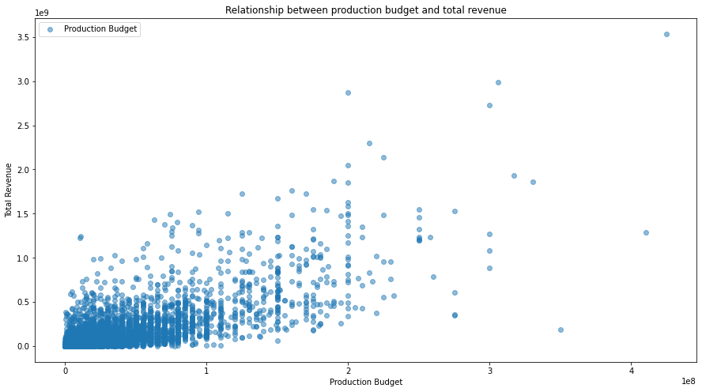
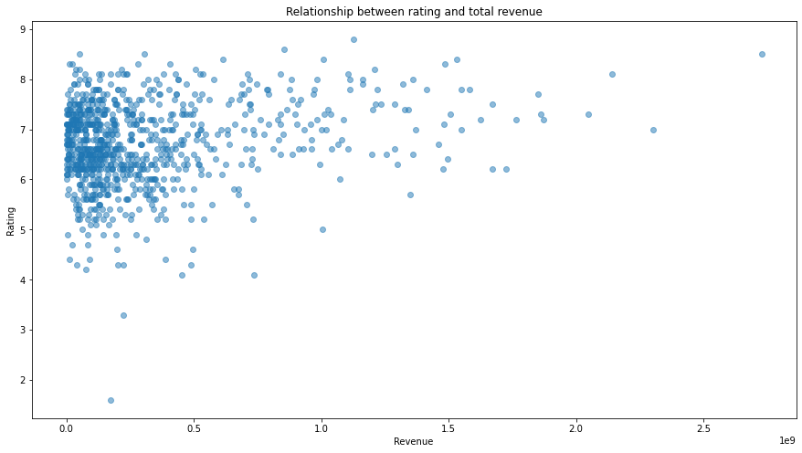
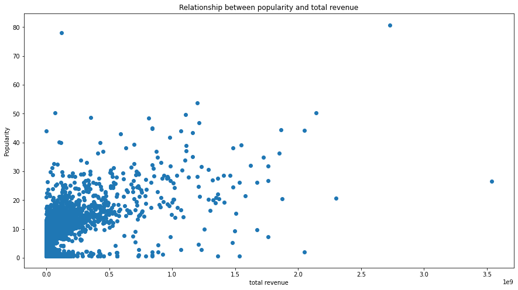

## OVERVIEW
Microsoft aims to maintain its competitive edge amid the rise of tech giants in the entertainment industry by venturing into a movie studio. Leveraging its expertise in data analytics and cloud technology, Microsoft can collect valuable user data, enabling personalized content recommendations and precise advertising. Additionally, the global appeal of streaming services offers a chance to expand its global presence and enhance brand recognition worldwide.

## BUSINESS UNDERSTANDING
Microsoft has ventured into the movie production industry. Being new , they lack expertise on film production among them audience preference and industry patterns. In this project I explore the elements that influence and determine the high  box office earnings attained by high performing films. This can be used to inform decisions on which films to create. 

## DATA UNDERSTANDING AND ANALYSIS
The data used is from:
* The Box Office Mojo
* IMDb
* The Numbers Movies Budget
* THe Moive DB
The data files provide the Title, Production Budget, Foreign and Domestic Gross, Popularity, Rating and Genre of each movies.

#### METHODS
This project employs summary statistics and statistical techniques, such as correlation analysis, to offer an insightful overview of the factors influencing box office performance.

#### RESULTS
There is a strong positive correlation between height and weight. As the production budget increases, total revenue tends to increase. However it is not a perfect relationship.

There is a very weak positive relationship between the IMDb rating and total revenue of the movies. Highly rated movies do not tend to have high revenue. The rating of a movie does not imply a high total revenue

There is a moderate positive relationship between the popularity of a movie and the total revenues. As the popularity increases, the revenue tends to increase even though moderately. 

### Conclusion
Budget Allocation Strategy - Allocate budgets strategically based on the observed positive correlation. Consider allocating resources to high-budget productions that have the potential generate substantial revenue. However be selective and base your decision on other factors such as genre analysis as the correlation is not perfect.

Genres
Genre Prioritization - Focus resources and efforts on genres that have consistently performed well in terms of total revenue, the genres in the top 50 genre categories. Direct more resources, both financial and creative to projects within these high revenue genres.

Budget optimization Strategy - Given the strong correlation between budget and revenue in the top genres, consider allocating budgets strategically to projects with these genres to maximise returns.  

Risk Management - A near perfect relationship indicates a lower level of risk in budget allocation for these genres. It suggests well funded project in the top genres are likely to yield more positive returns.

Popularity
Popularity driven marketing - Invest in effective marketing strategies that enhance the popularity of movies. Engage with the target audience through strategies like promotions, social media and interactive campaigns to boost anticipation and interest.

Ratings
Quality vs Commercial Appeal - While high IMdb ratings are important for prestige and reputation, recognize that ratings do not correlate with revenue. Diversify your movie portfolio to include high rated projects as well as commercially driven projects.

